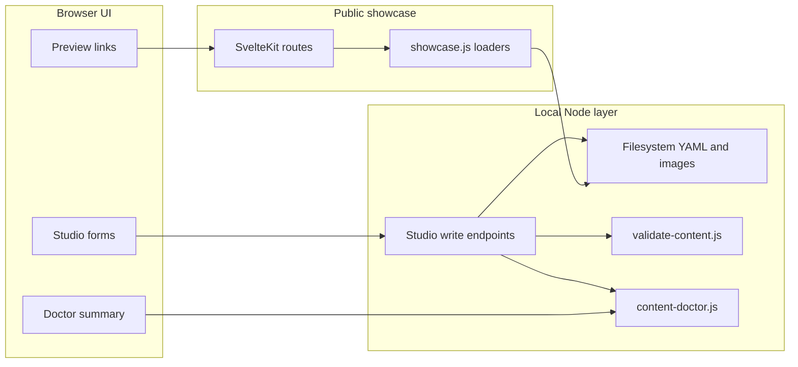

# ADR 0002: Local Studio research

## Status

Proposed

## Context

Atelier-Kit epic [#35](https://github.com/gcomneno/atelier-kit/issues/35) defines a staged path toward real no-code authoring.

Phase 3 introduces a **local studio**:

```bash
npm run studio
```

The studio should let a non-technical user edit file-based site content through a browser UI instead of YAML files, while preserving Atelier-Kit’s core model:

- no CMS database;
- no hosted accounts by default;
- readable YAML on disk;
- small static-friendly output;
- separation between framework repo and client site folders.

Today, Atelier-Kit already has:

- YAML config and content under `config/` and `content/`;
- server-side loaders in `src/lib/server/showcase.js`;
- validation in `scripts/validate-content.js`;
- publishing notes in `scripts/content-doctor.js`;
- Level 2 guided setup in `scripts/site-wizard.js`.

The open question for Phase 3 is not whether content should remain file-based. It should.

The question is how to add a **local-first authoring layer** without turning Atelier-Kit into the CMS it was designed to avoid.

## Decision

Atelier-Kit should implement the local studio as a **development-only authoring surface inside the existing SvelteKit app**, backed by **local filesystem write endpoints** and the **existing validation/doctor scripts**.

The first prototype should **not** introduce:

- a database;
- a hosted multi-user backend;
- a separate SaaS product;
- production-exposed write APIs.

The recommended command shape remains:

```bash
npm run studio
```

That command should start a local dev server with studio routes enabled and bound to localhost.

## Architecture options considered

### Option A — Studio routes inside the current SvelteKit app

Add routes such as:

```text
/studio
/studio/site
/studio/contact
/studio/items
/studio/items/[id]
/studio/collections
/studio/collections/[id]
/studio/preview
```

Write operations go through SvelteKit server endpoints, for example:

```text
src/routes/studio/api/site/+server.js
src/routes/studio/api/items/[id]/+server.js
```

Pros:

- reuses current content loaders and UI conventions;
- one install, one dev server, one preview origin;
- easiest path from existing validation scripts;
- keeps generated client sites portable.

Cons:

- studio code lives beside public showcase routes;
- requires careful production gating so write APIs never ship publicly.

### Option B — Separate local Vite/Svelte app

Run a second app dedicated to editing.

Pros:

- stronger separation between public site and authoring UI.

Cons:

- duplicate tooling and dependencies;
- harder preview integration;
- more setup for client sites;
- unnecessary for a first prototype.

### Option C — Hosted no-code studio

A remote web app stores content and exports or deploys sites.

Pros:

- best experience for non-technical users with no local setup.

Cons:

- conflicts with local-first and CMS-free positioning;
- requires accounts, storage, auth and operations;
- much larger product scope.

## Recommended approach

Choose **Option A**.

The studio should be a **local authoring shell** around the same files Atelier-Kit already uses.



## Proposed command and runtime model

### `npm run studio`

Recommended behavior:

1. set a studio-enabled dev flag, for example `ATELIER_STUDIO=1`;
2. start the existing Vite dev server;
3. open `/studio` on localhost;
4. refuse to start studio mode outside a local working directory that looks like an Atelier-Kit site.

Suggested script shape:

```json
"studio": "node scripts/studio-dev.js"
```

`scripts/studio-dev.js` should:

- verify `config/site.yaml` exists;
- print a clear local-only warning;
- spawn `vite dev --host 127.0.0.1` with studio env enabled.

### Production safety

Studio routes and write endpoints must not become a public production surface.

Recommended rules:

- studio layout server checks `dev` or `ATELIER_STUDIO`;
- write endpoints return `404` or `403` when studio mode is disabled;
- production build excludes studio-only UI where practical;
- adapter deployment should never rely on studio endpoints.

This preserves the current deploy model: the published site remains read-only content rendered by SvelteKit.

## Read and write boundaries

### Read path

Initial studio screens should reuse existing read logic from:

- `src/lib/server/showcase.js`
- direct YAML reads where forms need raw structure

Do not create a second content schema.

### Write path

Studio forms write the same files users edit manually today:

| Area | File(s) |
|---|---|
| Site identity | `config/site.yaml` |
| Catalog vocabulary | `config/catalog.yaml` |
| Contact actions | `config/contact.yaml` |
| Signal Clouds | `config/signal-clouds.yaml` |
| Items | `content/items/*.yaml` |
| Collections | `content/collections/*.yaml` |
| Images | `static/images/items/*` |

Write flow for every save:

1. validate request payload shape in the endpoint;
2. serialize to YAML with stable formatting;
3. write atomically to disk;
4. run structural validation;
5. return plain-language success or failure messages.

Prefer reusing `scripts/validate-content.js` and `scripts/content-doctor.js` through Node child processes or extracted shared helpers, rather than reimplementing rules in the UI.

## UX scope for the first prototype

The first studio milestone should optimize for **safe, understandable editing**, not full CMS parity.

### Prototype order

1. **Site config and contact** ([#38](https://github.com/gcomneno/atelier-kit/issues/38))
   - site title, tagline, language, notice;
   - email and optional WhatsApp.
2. **Item editor** ([#39](https://github.com/gcomneno/atelier-kit/issues/39))
   - list items;
   - edit title, description, status, meta fields;
   - keep image path field before full upload UI exists.
3. **Collections**
   - create/edit collection title and description;
   - assign existing item ids.
4. **Signal Clouds**
   - edit questions and options carefully; single-choice only.
5. **Image upload**
   - copy uploaded files into `static/images/items/`;
   - update item `image_file`.
6. **Doctor and publish readiness**
   - show friendly doctor output inside the studio;
   - link to preview and existing build/deploy docs.

### Non-goals for first prototype

- drag-and-drop page builder;
- theme marketplace;
- multi-user permissions;
- revision history;
- autosync to GitHub;
- WYSIWYG layout editing of Svelte components;
- hosted deployment from inside the studio.

## Form design principles

Forms should map to **user language**, not YAML structure.

Examples:

- “Site title” instead of `site.name`;
- “Contact email” instead of `contact.email.address`;
- “Material” instead of `meta[0].value`.

Validation errors shown in the studio should reuse the same plain-language direction introduced in Content Doctor ([#36](https://github.com/gcomneno/atelier-kit/issues/36)).

Every save action should answer:

- what changed;
- which file was updated;
- whether the site is structurally valid;
- whether anything still looks unpublished.

## Security and safety constraints

Local studio still writes to disk and must be conservative.

Minimum requirements:

- bind to `127.0.0.1` only;
- reject path traversal in item ids and filenames;
- allow writes only under approved project folders:
  - `config/`
  - `content/items/`
  - `content/collections/`
  - `static/images/items/`
- never execute arbitrary user code;
- never expose shell access through the UI;
- disable studio endpoints in production.

Optional later hardening:

- explicit client-site root env var;
- backup file before overwrite;
- dry-run preview of YAML changes.

## Relationship to other product levels

| Level | Tooling |
|---|---|
| Level 1 Developer-assisted | manual YAML + CLI |
| Level 2 Guided setup | `site:wizard`, scaffolds |
| Level 3 Real no-code | `studio` local UI |

The studio does not replace Level 1 or Level 2. It sits above them for users who need visual editing but can still accept local installation.

## Success criteria

This research decision is successful if the first studio prototype can:

1. start with `npm run studio` on localhost;
2. edit site identity and contact without YAML;
3. edit at least one item and save it back to disk;
4. run validation and show doctor notes in plain language;
5. preview the public site without a separate CMS backend.

The later no-code milestone remains:

> A non-technical user can create, edit, preview and export or publish an Atelier-Kit site entirely through a visual interface.

The first prototype only needs to prove that a local visual layer can write the existing file model safely.

## Consequences

Positive:

- keeps the file-based source of truth;
- reuses current validation and showcase architecture;
- gives Phase 3 a concrete implementation path;
- avoids premature SaaS scope.

Negative:

- studio code adds complexity to the main app;
- local install is still required in early prototypes;
- write endpoints need careful dev/prod separation;
- image upload and Signal Cloud editing remain non-trivial UI work.

## Follow-up implementation issues

- [#38](https://github.com/gcomneno/atelier-kit/issues/38) — prototype site config editor
- [#39](https://github.com/gcomneno/atelier-kit/issues/39) — prototype item editor
- [#40](https://github.com/gcomneno/atelier-kit/issues/40) — evaluate true no-code publishing options

## Related docs

- [`docs/product/product-levels.md`](../product/product-levels.md)
- [`docs/product/no-code-roadmap.md`](../product/no-code-roadmap.md)
- [`adr-0001-configurable-showcase-kit.md`](adr-0001-configurable-showcase-kit.md)
