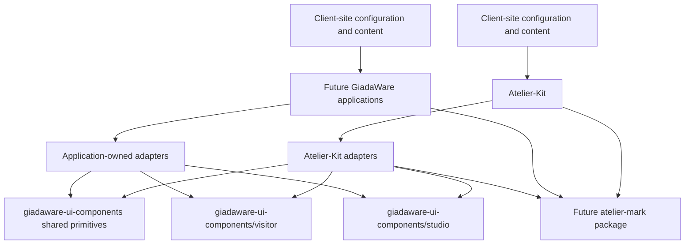

# `giadaware-ui-components` and Atelier-Kit boundaries

## 1. Status and scope

**Status:** accepted architecture for Phase 2; implementation is intentionally deferred to Phase 3.

This document defines the product, dependency, data, localization, styling, runtime, and migration boundaries between `giadaware-ui-components`, Atelier-Kit, future GiadaWare applications, and client sites assembled from configuration and content. It makes no repository, package, or extraction change.

The decisions are deliberately narrow. They cover components with demonstrated GiadaWare consumers and do not attempt to create a universal design system. Phase 3 may choose operational details listed below, but it must not reopen these boundaries without a new architecture decision.

## 2. Inputs and observed facts

The primary input is [`component-inventory.md`](./component-inventory.md), based on all 23 Svelte components in Atelier-Kit. The component sources, [`adr-0005-operator-ui-i18n.md`](./adr-0005-operator-ui-i18n.md), [`marked-text-inventory.md`](./marked-text-inventory.md), and [`adr-0006-editorial-extensions.md`](./adr-0006-editorial-extensions.md) were used to verify material claims.

Observed facts that constrain the boundary:

- the catalog mixes four low-, six medium-, and thirteen high-difficulty components, and has no runtime component or visual test suite;
- visitor and Studio components use different i18n contexts and token families;
- `SiteSearch` imports `$app/navigation` and `StudioNav` imports `$app/state`; several other components construct Atelier-Kit routes directly;
- Atelier Mark crosses parsing, HTML rendering, plain-text projection, accessibility, metadata, Studio authoring, font discovery, global classes, and CSS tokens;
- browser coupling includes `<dialog>`, storage, clipboard, selection/focus, timers, custom events, and navigation;
- the current application uses Svelte 5 and mixes runes with legacy syntax;
- client-site values are configuration and content consumed by Atelier-Kit. They are not package source and do not define `giadaware-ui-components` domain types.

## 3. Decision summary

### D1 — Product definition

**Decision.** `giadaware-ui-components` will be a small Svelte library containing generic UI primitives **and selected presentation components reused by real GiadaWare products**. It will not contain visitor or Studio features, domain workflows, application shells, content schemas, or head/SEO policy merely because their implementation is short.

**Rationale.** This is option 2 of the four product choices. Primitives alone would not capture useful GiadaWare presentation reuse; feature components would export application policy; a complete design system has neither demonstrated consumers nor an appropriate maintenance budget.

**Alternatives.** Generic primitives only; primitives plus visitor/Studio features; a complete design system.

**Consequences.** Admission requires at least one current consumer and a credible second GiadaWare consumer, a presentation-shaped API, and no Atelier-Kit dependency. The `giadaware-ui-components` incubation identity and the two trial API names are fixed; only a separate future npm publication identity may differ after the trial.

**Risks.** The package may initially look small, and teams may pressure it to absorb convenient application code.

**Reversal cost.** Low to broaden later; high to remove prematurely published feature APIs. Therefore the boundary starts narrow.

### D2 — Package topology

**Decision.** Use one package with explicit, non-overlapping entry points: `giadaware-ui-components` for shared primitives, `giadaware-ui-components/visitor` for admitted visitor presentation, and `giadaware-ui-components/studio` for admitted operator presentation. There is no catch-all barrel that re-exports visitor and Studio together. Each subpath must have an independent export graph and CSS entry; the root may export primitives only.

**Rationale.** One version and repository reduce operational overhead while subpath export graphs keep Studio code, copy, tokens, and browser adapters out of visitor bundles.

**Alternatives.** One entry point; separate packages; package-per-component. A future split into packages remains possible if the graphs or release cadences diverge.

**Consequences.** CI must prove that visitor entry points cannot reach Studio modules. Applications import the narrowest subpath.

**Risks.** Bundler misconfiguration can defeat source-level isolation; a single version couples release cadence.

**Reversal cost.** Medium: subpath exports can become packages through compatibility re-exports and codemods. Collapsing an already mixed entry point would be harder.

### D3 — Dependency direction

**Decision.** Atelier-Kit and other applications may depend on `giadaware-ui-components`; `giadaware-ui-components` may never depend on Atelier-Kit.

```text
Atelier-Kit     → giadaware-ui-components
other consumers → giadaware-ui-components
giadaware-ui-components ↛ Atelier-Kit
```

Svelte is the only required UI runtime and is a peer dependency. SvelteKit, `$app/*`, Atelier-Kit modules and contexts, application global styles, domain models, routes, persistence, and server logic are forbidden from every `giadaware-ui-components` export graph.

**Rationale.** A one-way graph makes the package independently testable, installable, and usable by future products.

**Alternatives.** Shared aliases into Atelier-Kit; optional peer access to application contexts; moving Atelier-Kit core UI wholesale.

**Consequences.** Applications own adapters and resolve data, labels, hrefs, navigation, storage, and rich-text rendering before crossing the boundary.

**Risks.** Adapter code can be repetitive or become an undocumented parallel API.

**Reversal cost.** Low to introduce a separate shared contract package later; very high to remove circular or implicit application dependencies after publication.

## 4. Target dependency model



No reverse edge exists from `giadaware-ui-components` to an application. Client configuration/content never imports `giadaware-ui-components`; an application validates and adapts it. The possible Atelier Mark package is a sibling dependency, not a dependency on Atelier-Kit or `giadaware-ui-components`.

### Allowed, forbidden, and future dependencies

| Dependency | Rule |
| --- | --- |
| `svelte` | Allowed as a peer dependency and for public component/runtime types. |
| SvelteKit and `$app/*` | Forbidden, including type-only imports. |
| Atelier-Kit modules, `$lib`, i18n contexts/catalogs | Forbidden. |
| Atelier Mark parser/models/classes | Forbidden in `giadaware-ui-components`; eligible for a future sibling package. |
| Item/content/domain models | Forbidden; adapt to neutral display models. |
| Route conventions and literal application routes | Forbidden; pass resolved `href` or navigation callbacks. |
| Application global styles/themes | Forbidden imports; host overrides only documented package tokens. |
| Persistence, clipboard, navigation, and browser services | Inject adapters/callbacks where a component truly needs them. Direct use is allowed only for a self-contained platform primitive with SSR-safe fallback and tests. |
| Other framework/runtime dependencies | None initially; additions require an architecture and bundle review. |

## 5. Product scope

Admission is based on responsibility, not file size. A component belongs when it presents neutral inputs, carries a coherent GiadaWare visual or interaction convention, and can be consumed without knowledge of an Atelier-Kit feature.

`giadaware-ui-components` must not become:

- a repository of components extracted only because they are small;
- a copy of Atelier-Kit's core UI or application shell;
- a generic design system without real consumers;
- a container for features disguised as configurable components.

Visitor surfaces are eligible only when they are presentation units, not catalog/search/content/configuration features. Studio surfaces are eligible only when they express reusable operator interaction, not an Atelier-Kit editing workflow. “Potentially reusable” is insufficient: a second credible product use and a stable neutral contract are required.

## 6. Package topology

The topology is a **single package with separate entry points**, not separate packages in Phase 3:

| Entry point | Owns | Must not expose |
| --- | --- | --- |
| `giadaware-ui-components` | dependency-light primitives and shared public types | visitor/Studio aggregators, application adapters |
| `giadaware-ui-components/visitor` | admitted visitor presentation and visitor token contract | Studio components, Studio tokens, operator copy |
| `giadaware-ui-components/studio` | admitted operator presentation and Studio token contract | visitor features/tokens, SvelteKit Studio routes |

Package export maps and graph tests are structural enforcement, not tree-shaking assumptions. A visitor import must not evaluate, bundle, or require Studio modules. CSS is opt-in per entry point/component; importing JavaScript must not implicitly import an Atelier-Kit theme. Separate packages are reconsidered only if independent consumers, dependencies, or release cadences make the single version materially harmful.

## 7. Ownership matrix

| Concern | Owner | Consumer | Rule | Decision status |
| --- | --- | --- | --- | --- |
| Svelte runtime | Host application; version range declared by `giadaware-ui-components` | Both | peer dependency, no bundled duplicate | decided |
| SvelteKit | Host application | Atelier-Kit/apps only | forbidden in package | decided |
| Visitor i18n | Host application | visitor components through props/callbacks | no package/Atelier contexts | decided |
| Studio/operator i18n | Host application | Studio components through props/callbacks | separate contract and keys | decided |
| CSS tokens | `giadaware-ui-components` names/defaults; host values | package components | neutral root tokens remain separate from any future visitor/Studio namespaces | decided |
| Themes and presets | Host application | site/app | package supplies no Atelier-Kit theme | decided |
| Atelier Mark | Atelier-Kit now; possible sibling package later | applications/adapters | outside `giadaware-ui-components` | decided |
| Domain types | Each application | application adapters | never copied into package | decided |
| Routing | Host application | links/navigation adapters | resolved href/callback only | decided |
| Persistence | Host application | injected callbacks/adapters | no application storage access | decided |
| Browser adapters | Host by default; component only for isolated platform behavior | interactive components | SSR-safe, replaceable, tested | decided |
| SVG and icons | `giadaware-ui-components` for admitted built-ins; host for brand assets | both | explicit registry and fallback | decided |
| Accessibility | Component owns semantics; host owns supplied names/content | both | public contract and tests | decided |
| Component tests | `giadaware-ui-components`; integration tests also in host | maintainers | gates below | decided |
| Trial identity | `giadaware-ui-components` maintainer | all applications | private `0.0.0` package; artifacts identified by commit, tarball, checksum | decided |
| Build and distribution | `giadaware-ui-components` pipeline | package consumers | Svelte source package, `npm pack`, installed-tarball test; no registry publication in trial | decided |

## 8. Initial extraction set

The private-incubation trial set is exactly **`SocialIcon` and `FormStatus`**. `FormStatus` is migrated from the historical Atelier-Kit source `src/lib/components/StudioFormStatus.svelte`. Both are context-free presentation units, and their remaining work defines foundational asset, token, runtime, and accessibility contracts without importing an application feature.

| Component | Category | Observed coupling | Public API/behavior | Missing tests | Required refactoring | Risk and motivation |
| --- | --- | --- | --- | --- | --- | --- |
| `JsonLd` | `excluded-from-giadaware-ui-components` | Svelte `<svelte:head>` and JSON serialization/escaping policy only | accepted JSON value, serialization and script injection policy | SSR output, escaping (`<`, `>`, U+2028/U+2029), invalid/cyclic values | none for portability; define a non-UI utility contract if reused | low implementation risk, but it is structured-data/SEO infrastructure rather than UI; consider an application utility or future head package instead of distorting product scope |
| `PageSocialMeta` | `remain-in-atelier-kit` | Svelte head; current Open Graph/Twitter policy | omission rules and `summary_large_image` policy | SSR head output, duplicates, absolute URL and empty-value behavior | none technically; policy needs a richer deliberate contract before reuse | low code risk but medium policy risk; no second consumer and it represents application SEO policy, not presentation |
| `SocialIcon` | `first-extraction-candidate` | fixed four-ID inline SVG selection; unknown IDs currently render the X glyph | supported IDs, decorative SVG semantics, sizing/current-color behavior, unknown-ID behavior | runtime render per ID, unknown ID, accessible use, snapshot/visual, installed-package/tree-shaking | explicit ID registry/type; return no icon for unknown IDs; retain `aria-hidden`; document caller-owned accessible name and provenance | low; genuine self-contained GiadaWare presentation reused by header/footer, provided the misleading fallback is removed before trial acceptance |
| `StudioFormStatus` | `first-extraction-candidate` | Svelte 5 `$effect`, timer lifecycle, fixed palette | tones, polite live region, message-reset and timeout semantics | runtime timers/cleanup, repeated message, SSR/hydration, live-region announcement, contrast | public name is `FormStatus`; typed tones; neutral root `--giu-form-status-*` tokens with accessible fallbacks; explicit persistent duration and dismissal policy | low-to-medium; reusable form feedback primitive, but auto-dismiss can hide errors and repeated identical messages need a defined behavior |
| `ImageLightbox` | `later-after-inversion` | visitor context, Atelier `{file, alt, role}`, legacy mutable props, native dialog/document | gallery model, controlled open/index, fit modes, wraparound, close/focus/keyboard behavior | dialog runtime, SSR/hydration, focus capture/restore, Escape/backdrop, arrows, names, responsive/visual | resolved label object including pluralized count; `{src, alt}` model; `onOpenChange`/`onIndexChange`; dialog capability fallback; remove context | medium-high accessibility and browser risk; useful across products only after the interaction contract is proven |
| `StudioFieldLabel` | `later-after-inversion` | operator context and parent convention; currently renders a span, not a semantic label | required/optional marker presentation, hint association and label ownership | runtime semantics, accessible name/description, required/optional rendering, visual | accept resolved marker labels; decide wrapper vs actual `<label>` and IDs; tokenize styling | medium; plausible Studio primitive, but publishing the current non-semantic structure would freeze an ambiguous API |
| `EditorialText` | `later-after-inversion` | Atelier Mark parser/resolvers/classes, site tokens, global `.tagline`/epigraph conventions | dynamic tag, raw-markup parsing/fallback, HTML safety, quote/display and token behavior | component runtime, SSR, injection cases, every syntax class, fallback, visual | first separate Atelier Mark ownership; then inject a renderer/snippet or consume a sibling package; eliminate application global selectors | high boundary risk; current component is an Atelier-Kit adapter over format-specific behavior, not yet a `giadaware-ui-components` primitive |

`JsonLd` and `PageSocialMeta` are head helpers, not UI. Their simplicity is not an extraction reason. The category for each candidate is exclusive and applies to the current architecture; changing it requires satisfying its stated gate.

## 9. Explicit exclusions

### Structural application features — remain in Atelier-Kit

`BookReading`, `CatalogSidebar`, `ItemCard`, `MetaInfo`, `SignalCloud`, `SiteHeader`, `SiteFooter`, `SiteSearch`, and `VisitorBrief` are excluded because they implement Atelier-Kit visitor features and composition policy:

- `BookReading` owns the news/book grammar and opinionated reading surface;
- `CatalogSidebar` owns block order, content models, dates, labels, and literal routes;
- `ItemCard` owns item/cover models, item routes, Atelier Mark, fallback policy, and metadata labels;
- `MetaInfo` owns the recursive item metadata presentation; a future neutral description-list primitive would be a different component;
- `SignalCloud` and `VisitorBrief` form an application workflow with storage keys, events, contact/share policy, domain models, and marked-text projection;
- `SiteHeader`, `SiteFooter`, and `SiteSearch` are application shell/search features with branding, configuration, navigation, i18n, routes, and global layout assumptions.

These exclusions are structural for the current components. Dependency inversion may reveal smaller primitives, but must not recreate the whole feature in `giadaware-ui-components`. `ItemCard`, `MetaInfo`, and a generic search combobox are reviewable only as new neutral contracts with real consumers; the original application components remain owned by Atelier-Kit.

### Studio application features — remain in Atelier-Kit

`MarkedTextField`, `StudioAccessGuide`, `StudioFormLegend`, `StudioItemGalleryFields`, `StudioItemMetaFields`, and `StudioNav` are excluded as features:

- `MarkedTextField` combines Atelier Mark authoring, preview, typography presets, operator copy, DOM selection, and form behavior;
- `StudioAccessGuide` encodes deployment/access workflow and operator copy;
- `StudioFormLegend` encodes a specific form convention; supplying content would create a different, trivial primitive;
- the gallery/meta field components own item edit shapes, field names, dirty-state protocol, ordering, and labels;
- `StudioNav` owns SvelteKit page state, fixed routes, information architecture, and keys.

Their exclusion is structural and feature-based, not merely first-phase scheduling. Small internal primitives discovered during future Studio work can be evaluated separately. `StudioFieldLabel` is the explicit exception already classified `later-after-inversion`.

### Brand responsibility

`KitCredit` is `excluded-from-giadaware-ui-components`: its entire purpose is Atelier-Kit attribution. This is structural even though the component is small and technically portable. An application may compose it next to package components.

## 10. Dependency inversion conventions

Application knowledge is converted at an adapter boundary owned and tested by the application:

- labels and short messages are resolved before rendering; plural/dynamic text uses narrow formatter callbacks;
- routes become resolved `href` values; imperative navigation becomes `onNavigate(href, context)` and normal anchors remain the progressive-enhancement baseline;
- persistence becomes `load`, `save`, and failure callbacks with neutral values; browser storage keys never cross into the component;
- item/content records become minimal immutable display models; adapter code maps application records explicitly;
- application services, dirty controls, and event buses become semantic callbacks such as `onChange` or `onDismiss`;
- rich content arrives through a snippet/renderer and plain text arrives separately where accessibility or metadata requires it.

No service locator, ambient application context, `$lib` alias, optional import, or global event name may bypass this boundary. A contract shared by multiple non-UI packages may later move to a separate package, but `giadaware-ui-components` must not become the owner of application domain contracts.

## 11. Localization strategy

### Decision

Components receive **already-resolved labels for finite static copy** and **formatter callbacks for pluralization or dynamic messages**. `giadaware-ui-components` owns no translation context, catalog, locale resolution, or translation keys. It provides no silent English defaults for user-visible or accessible text; required copy is required at the API boundary. Non-linguistic symbols and platform semantics may have documented fallbacks.

### Rationale and alternatives

Resolved values make the dependency explicit and allow Atelier-Kit's existing catalogs and future applications' localization systems to coexist. Callbacks preserve locale-aware pluralization and interpolation without exporting key ownership. Rejected alternatives are importing Atelier-Kit contexts, adding a package-owned localized context, and embedding English defaults. Those alternatives hide missing translations and couple visitor and operator release cycles.

### Visitor and Studio separation

- visitor copy, locale-aware number/date formatting, alt text, and accessible names are owned by the host's visitor locale and passed to `giadaware-ui-components/visitor`;
- Studio copy, validation/error/status wording, and accessible instructions are owned by the operator catalog and passed to `giadaware-ui-components/studio`;
- a shared primitive may accept neutral labels but never chooses between visitor and operator namespaces.

For counters such as the lightbox, pass a formatter `(current, total) => string`, not a concatenated English default. For status/errors, the host owns the message while the component owns live-region semantics. Missing required accessible copy is a development error with a clear diagnostic, not an English fallback. This keeps key ownership in each application and permits different visitor/operator locales.

**Consequences:** more explicit props and small adapter objects. **Risk:** verbose call sites or inconsistent wording. **Mitigation:** application-owned label factories. **Reversal cost:** low to add an optional independent localization adapter later; high to remove published package keys, so none are introduced now.

## 12. Styling and token strategy

`giadaware-ui-components` owns names, semantic meaning, fallback values, and compatibility policy for tokens used by its components. Hosts own actual theme values, presets, and placement. Every component must render legibly and accessibly when no host tokens are present.

- visitor and Studio tokens use separate package namespaces (for example `--giadaware-ui-components-visitor-*` and `--giadaware-ui-components-studio-*`); shared geometry/type tokens are rare and intentional;
- Phase 3 maps Atelier-Kit's `--site-*` and `--studio-*` values at the application adapter/theme layer; package code does not read those names directly;
- package defaults are neutral GiadaWare defaults, not an implicit Atelier-Kit theme;
- component styles are scoped. Global selectors are forbidden except a documented opt-in reset/layer or an intentionally rendered global rich-text class contract;
- JavaScript imports do not pull an application stylesheet. Package CSS entry points, if needed, are explicit and independently importable;
- `color-mix()` and `:has()` may be used only with a tested fallback that preserves readability, interaction, and layout. They cannot be prerequisites for core operation;
- baseline browser support includes SSR-capable modern browsers with native custom properties. Exact browser/version numbers are Phase 3, after checking actual GiadaWare deployments;
- host-supplied themes must pass contrast and focus-visible gates. The host owns site branding, dark/light selection, fonts, background images, and presets.

**Alternatives:** inherit Atelier-Kit tokens; ship one global theme; make every visual value a prop. These either recreate coupling, leak globally, or produce an unusable API. **Consequences:** an explicit mapping layer during migration. **Risk:** duplicate token vocabulary. **Reversal cost:** medium because public custom-property names are API and require deprecation aliases.

## 13. Data-contract strategy

Public components accept the smallest display model necessary to render:

- links contain an already-resolved `href`, label, and optional presentation metadata;
- images contain a resolved `src`, required accessibility decision (`alt` or explicitly decorative), and optional dimensions; the host resolves files, transforms, and fallbacks;
- navigation uses ordinary links first and an optional callback for interception;
- persistence and browser services use injected callbacks/adapters with explicit async/error behavior;
- rich content uses typed Svelte snippets/renderers; components that also need plain text receive it explicitly rather than scraping rendered HTML;
- state is controlled by a value plus `onXChange` by default. Internal uncontrolled state is appropriate only for ephemeral presentation state with a documented initial value;
- bindable state is offered only where two-way Svelte composition materially improves the API and callback semantics remain observable. It is not a shortcut for mutating application models.

Explicitly forbidden are copied Atelier-Kit item/content models, internal construction of Atelier-Kit routes, direct access to application persistence, and imports of Atelier-Kit normalizers, validation, server logic, configuration, or content loaders.

**Consequences:** Atelier-Kit owns mapping adapters and may keep richer domain types. **Risk:** display models proliferate. **Mitigation:** create one per demonstrated presentation need, not a generic content schema. **Reversal cost:** low while adapters are application-owned; high if package types become surrogate domain models.

## 14. Atelier Mark boundary

### Decision

Atelier Mark remains entirely in Atelier-Kit for the current phase. If a second application adopts the format, parsing/validation, safe visitor rendering, and plain-text projection may move together into a **separate `atelier-mark` sibling package**. Authoring UI, font discovery, and application token mapping remain application concerns unless separately proven reusable. `giadaware-ui-components` never owns or parses Atelier Mark.

Components needing rich text accept an injected Svelte snippet/renderer plus explicit plain text where needed. `EditorialText` therefore remains an Atelier-Kit adapter now and is only `later-after-inversion`; it does not enter `giadaware-ui-components` as currently designed.

| Concern | Current owner | Possible future owner | Boundary |
| --- | --- | --- | --- |
| Parsing and validation | Atelier-Kit | `atelier-mark` | grammar, validation result, safe intermediate output move together |
| Visitor rendering | `EditorialText` in Atelier-Kit | thin renderer consuming `atelier-mark` | injected into UI; no parser in `giadaware-ui-components` |
| Plain-text projection | Atelier-Kit | `atelier-mark` | shared with accessibility/SEO consumers |
| Studio authoring | Atelier-Kit `MarkedTextField` | Atelier-Kit until another editor exists | never implied by parser extraction |
| Font discovery | Atelier-Kit | application | depends on configured content and presets |
| CSS tokens/classes | Atelier-Kit/application | renderer contract plus host mapping | no undocumented global classes |

Extracting parser and renderer into `giadaware-ui-components` would couple a UI release to a content grammar; extracting only the renderer would still hide parsing and safety policy. Keeping everything forever in Atelier-Kit is viable but prevents deliberate format reuse. The sibling-package option has medium future cost and avoids present speculation. Reversing a format API after publishing it in `giadaware-ui-components` would be high cost.

## 15. Svelte and SvelteKit policy

- Svelte is a peer dependency. The package targets Svelte 5 and does not bundle its own runtime.
- New public components use Svelte 5 runes and current event/component APIs. Legacy syntax may exist only in unmigrated Atelier-Kit code; it is not copied into new public source.
- distribute Svelte components as source with types and package metadata so the consumer toolchain compiles them; build an installed tarball/fixture to verify this contract. Compiled auxiliary JavaScript is allowed where it has no component ABI.
- SvelteKit and all `$app/*` APIs are forbidden in source, generated declarations, and runtime output.
- SSR must produce deterministic useful markup without `window`, `document`, storage, or layout access during render. Hydration must not change meaning or emit warnings.
- browser-only capabilities are feature-detected after mount and have a documented fallback. Navigation and application storage use host adapters.
- support a declared Svelte 5 range and test its minimum and current supported versions. Exact bounds are Phase 3; direction is not.

**Alternatives:** bundle Svelte; distribute compiled-only components; support legacy Svelte versions; permit optional SvelteKit integrations. These increase duplicate runtimes, ABI coupling, or framework leakage. **Risk:** source distribution exposes compiler differences. **Reversal cost:** medium, managed during incubation through the compatibility matrix and after any future public release through the adopted versioning policy.

## 16. Assets and icons

Admitted generic icons are inline SVG components or per-icon modules: no remote sprite, runtime fetch, or opaque application asset path. The export graph must allow tree-shaking and must not load every icon when one is imported.

For `SocialIcon`:

- `giadaware-ui-components` owns an explicit closed registry of supported identifiers and SVG geometry;
- an unknown identifier renders no misleading glyph and surfaces a development diagnostic or explicit `null` result; it must never silently render X as today;
- the SVG remains decorative (`aria-hidden`) by default; the caller labels the enclosing link/button. A separately exposed standalone mode would require an accessible name;
- each glyph's source and license are recorded before extraction, and additions require license review;
- registry additions are backward-compatible; changing/removing an ID or glyph semantics follows deprecation/versioning rules;
- per-icon exports or compile-time branches must demonstrate tree-shaking in the installed-package test.

Site logos, photographs, client images, and brand-specific SVGs are host-provided resolved URLs or snippets and remain host assets. The package does not import Atelier-Kit logos or client content.

## 17. Public API principles

Every public component must follow these rules:

1. explicit, typed props with narrow neutral models and documented defaults;
2. semantic callbacks instead of application imports, contexts, global events, or service objects;
3. controlled state for application-significant values; uncontrolled state only for local presentation;
4. binding only when justified, with an equivalent observable callback and no hidden model mutation;
5. snippets/slots for composition and rich rendering, not untyped HTML strings; raw HTML requires a narrowly documented safety owner;
6. SSR-safe defaults and deterministic hydration;
7. native HTML/navigation/form behavior as the progressive-enhancement baseline;
8. feature detection and usable fallback for browser APIs;
9. component-owned semantics, keyboard interaction, focus behavior, names/description hooks, and status announcements;
10. explicit error behavior: reject invalid developer input clearly, expose recoverable runtime failures, and never substitute misleading content;
11. explicit compatibility review during private incubation for props, events, accessibility-relevant markup, tokens, exports, and behavior; any future public release adopts semantic versioning;
12. during private incubation, record breaking changes and migrate every trial consumer explicitly; after any future public release, deprecate before removal, document replacements, and apply the adopted compatibility policy unless correcting a security flaw.

## 18. Testing gates

### Mandatory before trial acceptance

- runtime component tests for props, callbacks, state transitions, timers, cleanup, invalid input, and each supported icon/status tone;
- SSR rendering and hydration without warnings for every exported component;
- keyboard and focus tests for any interactive component in the initial set; for non-interactive components, an explicit not-applicable assertion;
- accessible-name/role/live-region assertions, including `FormStatus` announcement semantics and decorative `SocialIcon` usage;
- automated contrast checks for default status tones plus a manual review of focus/contrast where automation is insufficient;
- representative responsive rendering and at least baseline visual snapshots for each exported state;
- installed-package test from a packed artifact, proving exports, types, CSS, no Atelier-Kit/SvelteKit imports, and no duplicate Svelte runtime;
- real Atelier-Kit integration consuming package imports, including SSR/build/check and a visitor-bundle graph assertion excluding `giadaware-ui-components/studio`;
- Svelte matrix at the minimum and current supported Svelte 5 versions.

The initial two non-composite components do not require broad keyboard-navigation or focus-management scenarios, but the harness and explicit applicability record are mandatory. Tests cannot be replaced by source-text assertions.

### Mandatory before later interactive extractions

`ImageLightbox` additionally requires native-dialog and fallback behavior, Escape/backdrop/arrows, focus entry/restoration, repeated open/close, image errors, localized counter/name behavior, hydration, and responsive visual regression. Any future search, editor, or persistence component requires full keyboard navigation, focus management, live regions, failure adapters, and progressive enhancement appropriate to that feature.

### Desirable after trial acceptance

- broader browser/device visual regression and forced-colors/reduced-motion coverage;
- assistive-technology smoke tests beyond automated semantics;
- performance and bundle budgets per entry point;
- multiple real GiadaWare consumer fixtures and previous-minor compatibility tests.

## 19. Migration sequence

Each stage is independently reviewable and stoppable; failure does not require migrating the catalog.

1. **Repository/package decision:** confirm the package's repository location, ownership, trial-artifact access, and one-package/subpath topology. Stop with Atelier-Kit unchanged if maintenance ownership is unavailable.
2. **Scaffold and harness:** create package metadata, explicit exports, source-distribution build, lint/type/runtime/SSR/hydration/installed-artifact tests, and dependency graph rules. Publish nothing yet.
3. **Tokens and minimum contracts:** define neutral root FormStatus token fallbacks, icon registry rules, status types/timer semantics, accessibility contracts, and Atelier-Kit token/label adapters.
4. **Reduced extraction:** port only `SocialIcon` and `FormStatus` from the historical `StudioFormStatus` source, preserving application behavior through explicit adapter/mapping code. Do not delete local implementations until integration passes.
5. **Consume from Atelier-Kit:** install the same checksummed tarball already proven in a clean consumer, then switch one consumer surface at a time. Both `SocialIcon` and `FormStatus` come from the root; the reserved `/studio` graph remains empty.
6. **Integration gates:** run package and Atelier-Kit SSR/build/check/runtime tests, installed-package fixture, accessibility/visual checks, Svelte matrix, and bundle graph inspection.
7. **Rollback:** restore the preceding tarball/dependency/lockfile or revert Atelier-Kit imports to retained local components. No registry action or content/config migration exists; token aliases/adapters make rollback local.
8. **Evaluate:** collect bundle, API, accessibility, adapter, and second-consumer evidence. Decide explicitly whether to stop, refine, or admit exactly one later candidate. No catalog-wide migration follows automatically.

## 20. Rejected alternatives

| Alternative | Why rejected | Consequence/risk avoided | Reversal cost if chosen |
| --- | --- | --- | --- |
| Generic primitives only | misses proven GiadaWare presentation reuse such as social glyphs | avoids an artificially sterile package while retaining a gate | low to broaden |
| Visitor and Studio features in `giadaware-ui-components` | exports domain, routing, persistence, and workflow policy | package remains presentational | high to untangle public features |
| Complete universal design system | no consumers or governance justify it | avoids speculative API/token surface | very high |
| Single catch-all entry point | permits accidental Studio reachability from visitor bundles | graph is enforceable by subpaths | medium-high |
| Separate packages immediately | premature release/version overhead for two initial components | operational model stays small | medium to split later |
| Import Atelier-Kit contexts/catalogs | reverses dependency direction | independent package and apps | very high |
| Package-owned English defaults | hides missing localization, especially accessibility copy | hosts own language quality | medium-high after API adoption |
| Copy application domain types | creates drifting surrogate models | adapters remain explicit | high |
| Put Atelier Mark in `giadaware-ui-components` | couples content grammar and UI release | format can become a sibling package | high |
| Extract head helpers because they are small | SEO/serialization policy is not UI | product scope stays coherent | low to create a utility later |

## 21. Deferred Phase 3 details

Only operational choices are deferred:

- any future npm publication identity, registry availability, provenance/signing, and publication automation after the trial; the current repository and private-incubation package identity remain `giadaware-ui-components`;
- exact peer dependency bounds within Svelte 5 and the tested minimum/current versions;
- exact browser/version baseline after deployment evidence is collected;
- build tool, package metadata details, declaration generation, and whether per-component exports supplement the three required entry points;
- exact fallback values for the fixed neutral root `--giu-form-status-*` tokens and the Atelier-Kit mapping; token names and root ownership are not deferred;
- exact forwarding details, internal implementation, and any future optional props for the two decided public components;
- test runner, DOM/browser harness, visual-regression service, and bundle analyzer;
- icon source/license records and whether the implementation uses per-icon modules or a compile-time registry;
- future public SemVer, prerelease cadence, dist-tags, and deprecation duration.

Phase 3 may not defer or reverse the one-way dependency, Svelte peer/SvelteKit prohibition, subpath isolation, host-owned i18n/domain/routing/persistence, package-owned token defaults, Atelier Mark exclusion, or initial two-component scope.

## 22. Consequences and risks

### Positive consequences

- future GiadaWare applications can consume presentation without adopting Atelier-Kit or SvelteKit;
- visitor bundles have a mechanically enforceable boundary from Studio dependencies;
- client configuration/content remains portable application data rather than package API;
- a two-component trial validates distribution and governance before costly feature inversion;
- adapters provide visible locations for routing, i18n, domain, theme, and persistence policy.

### Costs and mitigations

| Risk/cost | Likelihood/impact | Mitigation | Cost of future reversal |
| --- | --- | --- | --- |
| Package is too small to justify repository and maintenance overhead | medium/medium | require second-consumer evidence and stop after evaluation if absent | low; retain components in Atelier-Kit |
| Studio leaks into visitor bundle | low/high | export-graph and bundle tests; no aggregate barrel | medium if caught after broader consumer adoption |
| Adapters duplicate code | medium/low | application-owned factories, not shared domain package prematurely | low |
| Token divergence from Atelier-Kit | medium/medium | explicit mapping and deprecation aliases | medium |
| Accessibility regression during extraction | medium/high | runtime, SSR/hydration, live-region/contrast gates and local rollback | high after broad adoption |
| Source distribution/compiler incompatibility | medium/medium | Svelte matrix and installed-artifact fixture | medium |
| Feature pressure expands product scope | high/high | admission criteria and architecture review | high once feature APIs are public |
| Atelier Mark sibling never materializes | medium/low | keep adapter in Atelier-Kit; UI accepts injected renderer | none |
| Unknown social IDs change behavior | medium/low | explicit no-icon fallback, diagnostics, migration test | low during private incubation |

The principal trade-off is intentional adapter work and a smaller initial package in exchange for reversibility. The most expensive reversal would be removing Atelier-Kit feature/domain dependencies from a published library, so the design prevents them rather than promising later cleanup.

## 23. Phase 3 entry criteria

Phase 3 may begin only when all of the following are true:

- repository/package ownership, maintenance responsibility, and trial-artifact responsibility are assigned;
- at least Atelier-Kit plus one credible future GiadaWare use is recorded for each initial responsibility, while Atelier-Kit remains only the first validation consumer;
- the three-entry-point export graph and no-Studio-in-visitor check are specified;
- Svelte 5 peer/source-distribution direction and a candidate version matrix are agreed;
- the initial API notes settle `SocialIcon` unknown IDs/licensing and `FormStatus` timeout/live-region/token behavior;
- host-side i18n and token adapter designs are reviewed without importing Atelier-Kit into the package;
- mandatory test harness work is estimated and assigned, including installed-package and Atelier-Kit integration fixtures;
- rollback is demonstrably limited to component imports/adapters, with no client content/config migration;
- no proposal includes `JsonLd`, `PageSocialMeta`, Atelier Mark, application features, or later candidates in the first extraction.

Meeting these criteria authorizes scaffolding and the two-component trial only. Adding any later candidate requires its individual inversion and testing gate plus evidence from the evaluation stage.
