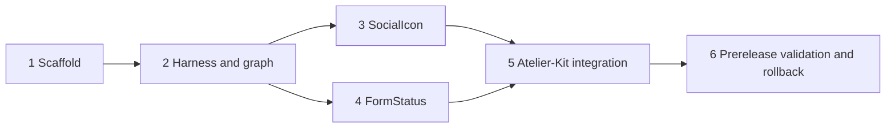

# `giada-ui` package plan and first extraction trial

## Status and scope

**Status:** Phase 3 implementation plan, based on Atelier-Kit commit `d1590b1`. This document authorizes no repository creation, publication, code move, dependency change, or broader extraction. The trial contains exactly `SocialIcon` and `FormStatus`; the current Atelier-Kit source `src/lib/components/StudioFormStatus.svelte` is historical migration input only. `JsonLd`, `PageSocialMeta`, Atelier Mark, and every other component remain out of scope.

Evidence labels used below are **Observed** (verified in this repository), **Decision** (binding for the trial), **Assumption to verify** (must become evidence before implementation passes), and **Deferred** (deliberately not needed to begin the trial).

The output of this phase is an ordered, reversible set of implementation issues. Passing the trial proves only that these two components can cross the boundary.

## Inputs and fixed architectural decisions

**Observed:** `component-inventory.md` inventories 23 components and identifies these two as low-coupling candidates. `giada-ui-boundaries.md` fixes the product boundary, dependency direction, entry points, Svelte policy, localization ownership, Atelier Mark exclusion, and trial set. The current sources were inspected directly: `SocialIcon` is a runes component with four effective identifiers and a misleading X-shaped catch-all; the historical Atelier-Kit component `src/lib/components/StudioFormStatus.svelte` is a runes component with a five-second timer, four tones, and a polite status live region. There are no runtime component tests today.

Fixed constraints:

- `giada-ui` is a small Svelte presentation library for GiadaWare, not a universal design system and not an Atelier-Kit feature package.
- `giada-ui` is autonomous and has no dependency on Atelier-Kit. Atelier-Kit is only its first validation consumer, not its owner, required runtime, or peer; every actual consumer independently owns its package version, manifest, and lockfile.
- Svelte is a peer dependency. Runtime exports cannot use SvelteKit, `$app/*`, Atelier-Kit contexts, catalogs, domain models, routes, configuration, content, or server modules.
- Public graphs are root, visitor, and Studio; root is shared primitives only. `/visitor` and `/studio` remain reserved and may expose intentionally empty APIs in this trial. `/studio` is a possible future graph for genuinely specialized operational presentation, not a dependency on the Atelier-Kit Studio application. Atelier Mark remains outside.
- The trial is exactly `SocialIcon` and `FormStatus`; it grants no later admission.

## Decision summary

| Area | Decision | Evidence/verification boundary |
| --- | --- | --- |
| Repository | Public `gcomneno/giada-ui`, default branch `main`, MIT | `gcomneno` owns current `atelier-kit`; future organization does not yet exist |
| Package | Public `@giadaware/giada-ui`, conditional on scope ownership; temporary fallback `giada-ui` only if that unscoped name is verified available and controlled | npm ownership/availability must be checked immediately before scaffold/publication |
| First version | `0.1.0-alpha.1`, npm dist-tag `next` | No stable compatibility promise during trial |
| Distribution | Svelte 5 source package built/validated with `svelte-package`; declarations and explicit exports in the packed artifact | Exact current official packaging options must be verified during scaffold |
| Entry graph | root: `SocialIcon`, `SocialIconId`, `FormStatus`, `FormStatusTone`; visitor and studio: intentionally empty APIs initially; separate explicit CSS subpaths retained | No aggregate barrel imports visitor and Studio; `/studio` is reserved for future specialized operational presentation |
| CSS | Scoped component CSS; no automatic global CSS; neutral `--giu-form-status-*` tokens belong to root; neutral accessible fallbacks | Atelier-Kit may map current `--studio-*` values at its host boundary; package code never reads them |
| Integration | Develop with local packed tarballs; final trial installs the prerelease artifact, never relies only on symlinks | Mirrors what npm publishes |
| Consumer model | Every application that imports `giada-ui` declares it normally; applications that do not use it install nothing | Copied standalone Atelier-Kit clients declare it because their copied code imports it; future consumers own version, manifest, and lockfile independently |

For every important decision in later sections, the compact record uses the required fields: **Decision, Rationale, Alternatives, Consequences, Risks, Reversal cost**.

## Repository identity

**Decision:** create, in a later issue, the public repository `gcomneno/giada-ui`, with `main` as default branch and MIT license carrying the appropriate copyright holder/year. README owns purpose, non-goals, install/import examples, compatibility, accessibility, token, release, and support contracts. `CHANGELOG.md` follows Keep a Changelog-style release sections. GitHub Issues is the tracker. The `gcomneno` maintainer account owns triage and release approval initially. Minimal `CONTRIBUTING.md` requires focused changes, tests, icon provenance, and boundary compliance. `SECURITY.md` requests private GitHub security advisories; security reports must not begin as public issues.

**Rationale:** the current remote is `github.com/gcomneno/atelier-kit`, the current license is MIT, and the repository already uses a README, changelog, contribution guide, issue templates, GitHub Actions, and one-maintainer-oriented policy. `gcomneno/giada-ui` is applicable today. A future GiadaWare organization has no evidenced existence or owners.

**Alternatives:** wait for or create a GiadaWare organization; private repository; monorepo directory. Waiting blocks the trial on nonexistent governance; private distribution conflicts with a reusable public library; a monorepo would not test the intended repository/release boundary.

**Consequences:** repository transfer to a future organization is an administrative change; README and links must redirect, while package identity can remain stable. Issues and releases live with the package rather than Atelier-Kit.

**Risks:** single-owner bus factor and later transfer friction. Protect `main`, require CI, enable two-factor authentication for npm/GitHub publishing, and document a second maintainer before stable release.

**Reversal cost:** low before publication; low-to-medium after publication because GitHub transfers preserve redirects but automation secrets and badges must move.

### Ownership matrix

| Concern | Accountable | Responsible now | Consulted | Escalation/gate |
| --- | --- | --- | --- | --- |
| Scope/API/tokens | `giada-ui` maintainer | `gcomneno` | Atelier-Kit maintainer/consumers | architecture review for public API changes |
| Repository/issues/security | repository owner | `gcomneno` | reporters/contributors | private advisory for vulnerabilities |
| CI and compatibility | `giada-ui` maintainer | change author | Atelier-Kit maintainer | all blocking jobs green |
| npm release | release owner | `gcomneno` initially | change author | explicit approval; no publish on ordinary PR |
| Atelier-Kit adapter/integration | Atelier-Kit maintainer | integration issue owner | package maintainer | kit check/build/integration gates |
| Icon provenance | package maintainer | icon contributor | legal/license reviewer if uncertain | recorded source/license required |

## Package identity

**Decision:** recommend public `@giadaware/giada-ui`; publish no package until npm proves that `@giadaware` exists, is controlled by the release owner, permits public packages, and has protected publishing credentials. Canonical imports are `@giadaware/giada-ui`, `/visitor`, `/studio`, and explicit CSS subpaths. Start at `0.1.0-alpha.1`.

If scope ownership cannot be established, **do not impersonate the scope**. The permitted temporary fallback is public unscoped `giada-ui` only after verifying availability, ownership, and squatting risk on npm. If neither is controlled, the trial remains an unpublished tarball and stops before registry validation. There is no private-package fallback.

**Rationale:** the scope expresses GiadaWare ownership, reduces ambiguous name-squatting exposure, and keeps imports readable. The current GitHub owner is personal, but repository owner and npm scope need not match. An unscoped-to-scoped rename changes every import and dependency key.

**Alternatives:** `giada-ui` is shorter but globally collision-prone; a personal scope ties product identity to an individual; a private package adds authentication to client installs.

**Consequences:** canonical documentation uses the scoped name. A temporary unscoped publication must be treated as a different package and deprecated, not transparently renamed. Migration would require a release, dependency/import rewrite, and lockfile refresh.

**Risks:** unavailable/unowned scope, supply-chain impersonation, or abandoned fallback name. Registry verification and provenance are first scaffold acceptance criteria.

**Reversal cost:** low while tarball-only; medium-high after consumer publication because npm package names are immutable identities.

## Proposed repository structure

Only files needed for the trial are proposed:

```text
giada-ui/
├── .github/workflows/ci.yml
├── src/
│   ├── lib/
│   │   ├── index.ts                 # root: shared primitives only
│   │   ├── SocialIcon.svelte
│   │   ├── social-icon.ts           # SocialIconId and closed registry data
│   │   ├── FormStatus.svelte
│   │   ├── form-status.ts            # FormStatusTone and timer validation
│   │   └── styles.css               # root FormStatus token declarations if needed
│   ├── visitor/
│   │   ├── index.ts                 # deliberately empty public API initially
│   │   └── styles.css               # empty/no-op initially; validates isolation
│   └── studio/
│       ├── index.ts                 # deliberately empty public API initially
│       └── styles.css               # empty/no-op initially; validates isolation
├── tests/
│   ├── runtime/SocialIcon.test.ts
│   ├── runtime/FormStatus.test.ts
│   ├── ssr/components.test.ts
│   ├── hydration/components.test.ts
│   ├── a11y/components.test.ts
│   ├── graph/exports.test.ts
│   ├── package/packed-artifact.test.ts
│   └── visual/fixtures.test.ts
├── fixtures/
│   ├── consumer/                    # external Svelte consumer installed from tarball
│   └── atelier-kit/README.md         # recipe/pointer; real integration runs in Atelier-Kit
├── examples/basic/                  # two-component manual fixture, not a product site
├── scripts/
│   ├── check-boundaries.mjs
│   ├── inspect-pack.mjs
│   └── inspect-bundles.mjs
├── package.json
├── svelte.config.js
├── vite.config.ts
├── tsconfig.json
├── README.md
├── CHANGELOG.md
├── CONTRIBUTING.md
├── SECURITY.md
└── LICENSE
```

**Decision:** tests and fixtures are not published; only generated package output, README, changelog, and license are packed. **Rationale:** the tree makes every graph/test responsibility visible without speculative design-system directories. **Alternatives:** one `src/lib` barrel or separate packages; both undermine this trial's isolation/operational goal. **Consequences:** a small amount of duplicated entry CSS scaffolding. **Risks:** empty visitor entry may be confusing; document it as reserved and test it imports no Studio code. **Reversal cost:** low before stable release.

## Package exports

Candidate export map shape (exact generated paths must be confirmed against the chosen official scaffold):

| Public specifier | `svelte` | `types` | default/import | Contents | CSS effect |
| --- | --- | --- | --- | --- | --- |
| `.` | `./dist/index.js` | `./dist/index.d.ts` | `./dist/index.js` | `SocialIcon`, `SocialIconId`, `FormStatus`, `FormStatusTone`, supported IDs | none automatic |
| `./visitor` | `./dist/visitor/index.js` | `./dist/visitor/index.d.ts` | same | no component in trial; stable isolated graph | none |
| `./studio` | `./dist/studio/index.js` | `./dist/studio/index.d.ts` | same | no component in trial; reserved isolated graph | none automatic |
| `./styles.css` | n/a | n/a | `./dist/styles.css` | shared/root CSS, including FormStatus tokens | explicit import |
| `./visitor/styles.css` | n/a | n/a | `./dist/visitor/styles.css` | visitor-only CSS | explicit import |
| `./studio/styles.css` | n/a | n/a | `./dist/studio/styles.css` | empty/no-op initially; reserved Studio CSS graph | explicit import |
| `./package.json` | n/a | n/a | `./package.json` | tooling metadata | none |

**Decision:** `SocialIcon`, `SocialIconId`, `FormStatus`, and `FormStatusTone` are root exports because both components are shared primitives. Canonical use is:

```js
import {
  SocialIcon,
  type SocialIconId,
  FormStatus,
  type FormStatusTone
} from '@giadaware/giada-ui';
```

Visitor may safely re-export shared primitives only after a demonstrated consumer need, not in this trial. `/visitor` and `/studio` remain separate reserved graphs with intentionally empty APIs; `/studio` does not denote or depend on the Atelier-Kit Studio application and may later contain only genuinely specialized operational presentation. No per-component public subpaths initially: they multiply compatibility surface without improving tree shaking for two isolated exports. `files` includes `dist`, `README.md`, `CHANGELOG.md`, and `LICENSE`. `sideEffects` lists CSS globs only; JS/Svelte exports are side-effect-free. Source is processed into publishable source/declarations under `dist`; consumers compile Svelte component source through their Svelte toolchain.

```mermaid
flowchart LR
  C[Any importing consumer] --> ROOT[package root]
  ROOT --> SI[SocialIcon]
  ROOT --> FS[FormStatus]
  VIS[/visitor: reserved empty graph]
  STUDIO[/studio: reserved empty graph]
  ROOT -. forbidden .-> VIS
  ROOT -. forbidden .-> STUDIO
  VIS -. forbidden .-> STUDIO
  GU[giada-ui] -. forbidden .-> AK[Atelier-Kit internals/scaffold/Desktop]
```

**Rationale:** physical subpaths make bundler and graph assertions possible; root does not import visitor or Studio, while the complete trial API needs one root import. **Alternatives:** catch-all barrel, component subpaths, or placing generic form feedback under `/studio`. **Consequences:** reserved graphs remain available without coupling generic primitives to them. **Risks:** a tool may resolve conditions differently; packed consumer tests exercise `svelte`, `types`, and default resolution. **Reversal cost:** medium once exports are public.

## Svelte compatibility and distribution

**Observed:** Atelier-Kit currently declares Svelte `^5.56.1`, SvelteKit `^2.63.0`, Vite `^8.0.16`, plugin-svelte `^7.1.2`, TypeScript `^6.0.3`, and CI Node 24. Both trial components already use runes; the repository mixes JS/JSDoc and Svelte source. Vite uses `sveltekit()` plus a YAML plugin. No library packaging config or official packaging guide is checked into this repository.

**Decision:** Svelte 5 is the only baseline. Candidate peer range is `^5.56.1`, with Svelte also a dev dependency at the tested current version and never a runtime dependency. Confirm the minimum by running the complete matrix; lower it only with evidence. New public source uses runes and TypeScript for exported types; legacy syntax is not copied. Use the official current `svelte-package` flow to emit package source and declarations. Do not hand-invent flags: scaffold issue must verify commands/options against primary Svelte documentation available then. Publish source-oriented `.svelte` output plus declarations and auxiliary compiled JS, not compiled-only component ABI.

SSR output must be deterministic; timers start only after hydration/effect execution. Hydration must have no mismatch/warning. SvelteKit is allowed only as a dev-only fixture/test tool and must not be reachable from packed runtime exports. Candidate build/test Node baseline is 24 because that is current repository CI; before stable release choose the lowest maintained Node line supported by all selected tools and test it. Candidate browser baseline is the current and previous major versions of Chromium, Firefox, and Safari with CSS custom properties; exact versions are an **assumption to verify** against deployed GiadaWare sites. Core behavior cannot depend on `color-mix`, animations, or JS-only styling.

Dependency classes: Svelte peer+dev; test runners, DOM/browser harness, SvelteKit fixture, compiler, and `svelte-package` dev-only; zero trial runtime dependencies unless a later issue justifies one. A lockfile and `npm ls svelte`/packed consumer inspection prevent a second Svelte copy.

**Alternatives:** bundled Svelte, compiled-only components, SvelteKit runtime integration, or Svelte 4 compatibility. **Consequences:** consumer compiler compatibility becomes a tested contract. **Risks:** source/compiler drift and uncertain exact minimums. **Reversal cost:** medium; changing peer/source policy may require a major version after stable.

## Export-graph enforcement

Use layered checks; source scanning alone is insufficient.

| Control | Input | Candidate implementation/output | Failure condition |
| --- | --- | --- | --- |
| Forbidden import scan | `src`, generated declarations/output | ESLint `no-restricted-imports` or dependency-cruiser rules plus targeted scan | `$app/*`, `$lib`, `@sveltejs/kit`, `atelier-kit`, contexts/catalog/domain/server paths found |
| Source graph | three entry files and all reachable source | dependency-cruiser or Madge JSON graph consumed by `check-boundaries.mjs` | root reaches visitor/Studio; visitor reaches Studio; Studio reaches visitor without allowlist |
| Built graph | built chunks/metafile for one import per entry | Vite/Rollup manifest or esbuild metafile inspected by script | visitor chunk contains Studio module/CSS; root contains either graph |
| Packed allowlist | `npm pack --json` tarball | `inspect-pack.mjs` prints sorted files and package metadata | unexpected source, fixture, config, secret, test, or missing license/types/export |
| External consumer | clean fixture installs tarball | check, SSR build, browser build, import/type probes | any public specifier/types/CSS fails |
| Svelte singleton | consumer lock/tree and bundle | `npm ls svelte`, lockfile parse, bundle module list | multiple resolved Svelte versions/copies or bundled runtime |
| CSS isolation | visitor-only and studio-only fixture manifests/CSS | built CSS module/source list and forbidden-token scan | either reserved graph contains root FormStatus CSS/tokens |

**Decision:** all controls block prerelease except bundle-size trend, which is advisory until a stable budget is measured. Scripts emit machine-readable JSON plus concise diagnostics and nonzero exit status. **Rationale:** source graph catches architecture; built graph catches re-export/bundler behavior; tarball and fixture catch distribution reality. **Alternatives:** `rg` only or bundle inspection only. **Consequences:** a few dev-only graph tools. **Risks:** false positives from type-only imports or generated code; rules need explicit type-edge policy. **Reversal cost:** low; checks do not affect runtime API.

## CSS and token contract

**Decision:** component layout rules remain scoped. JS imports do not auto-import global CSS. Explicit root/visitor/Studio CSS entry points remain, but FormStatus CSS and tokens belong to the root, not `/studio/styles.css`. The component-critical fallbacks remain in scoped component CSS so a missing CSS import never makes status unreadable. `SocialIcon` sets `fill: currentColor`, has no presets/theme, and inherits dimensions from explicit props.

Initial public FormStatus tokens are:

- `--giu-form-status-radius`, `--giu-form-status-padding`, `--giu-form-status-gap`;
- `--giu-form-status-success-text`, `--giu-form-status-success-background`, `--giu-form-status-success-border`;
- `--giu-form-status-error-text`, `--giu-form-status-error-background`, `--giu-form-status-error-border`;
- `--giu-form-status-warning-text`, `--giu-form-status-warning-background`, `--giu-form-status-warning-border`;
- `--giu-form-status-info-text`, `--giu-form-status-info-background`, `--giu-form-status-info-border`.

Any future dismiss/focus tokens use the same neutral `--giu-form-status-*` prefix. Fallbacks are neutral, opaque/light-tinted pairs with at least WCAG AA normal-text contrast; exact values are fixed by the component issue after automated and manual contrast evidence. Atelier-Kit may map its existing Studio theme to these public tokens at its host layer, but package code neither knows nor reads `--studio-*`. Light/dark is host token override plus independently legible defaults; no hidden `prefers-color-scheme` theme. In forced colors, use system colors and a visible border. No motion is required for the trial; if later added, it is disabled under `prefers-reduced-motion: reduce`. Responsive behavior is intrinsic wrapping with `overflow-wrap: anywhere`; no fixed width.

**Rationale:** public custom properties are a small semantic API and fallbacks preserve standalone operation. **Alternatives:** current hard-coded colors only, Atelier-Kit tokens, global theme, or value props. **Consequences:** mapping adapter and contrast tests. **Risks:** token proliferation and branded overrides that fail contrast; document host responsibility and test Atelier-Kit mapping. **Reversal cost:** medium; token renames need aliases/deprecation.

## SocialIcon API

Final name: `SocialIcon`. Initial closed IDs: `'instagram' | 'facebook' | 'github' | 'x'`. The current catch-all path is X; migration must translate only validated IDs and never rely on fallback. Export `type SocialIconId` and `SOCIAL_ICON_IDS` readonly data.

| Prop | Type | Default | Required | Semantics | SSR behavior | Accessibility behavior |
| --- | --- | --- | --- | --- | --- | --- |
| `id` | `SocialIconId` | none | yes | selects exact registered glyph | deterministic inline SVG or no node for invalid runtime value | does not infer network text |
| `size` | `number | string` | `24` | no | sets both width/height; positive finite number means CSS px, string is CSS length | serialized identically | visual only |
| `width` | `number | string` | `undefined` | no | overrides width derived from `size` | deterministic | visual only |
| `height` | `number | string` | `undefined` | no | overrides height derived from `size` | deterministic | visual only |
| `decorative` | `boolean` | `true` | no | chooses decorative vs informative contract | deterministic attributes | true => `aria-hidden="true"`; false requires `ariaLabel` |
| `ariaLabel` | `string | undefined` | `undefined` | required when non-decorative | accessible name supplied by consumer | serialized | nonempty name; no English fallback |
| `title` | `string | undefined` | `undefined` | no | optional SVG title, never sole required naming mechanism | stable title/id generated SSR-safely | supplementary description; consumer-localized |
| `class` | `string` | `''` | no | forwarded to SVG | stable | none |
| `style` | `string | undefined` | `undefined` | no | forwarded to SVG | stable | host retains contrast responsibility |
| `...rest` | safe `SVGAttributes<SVGSVGElement>` subset | none | no | forwards ordinary SVG data/event/ARIA attributes except package-owned `viewBox`, semantics and geometry | serializable attributes render | cannot override contract-owned hidden/role/name inconsistently |

**Decision:** informative mode renders `role="img"` with the supplied label; decorative mode renders `aria-hidden="true"` and no role. Unknown runtime ID renders nothing, emits one development-only warning, and never throws in production or substitutes a glyph. There is no generic fallback prop in the initial API. The empty result is identical on SSR and client. Each icon lives in its own geometry module or a compiler-proven tree-shakable registry; the installed bundle test proves unused geometry exclusion. `viewBox` is `0 0 24 24`; width/height precedence is explicit above; fill is `currentColor`.

The current geometry's provenance/license is **not evidenced in this repository**. Extraction blocks until every path has a recorded source URL/version, license/trademark note, and compatibility with MIT redistribution; redraw/replace any unprovable path. Adding an icon requires a focused issue/PR, documented identifier and provenance, accessible/decorative fixture, SSR/runtime snapshot, unknown-ID invariant, and semver review. Network name and enclosing link text/label remain consumer responsibilities.

Migration: `SiteHeader` and `SiteFooter` import from package root, keep their existing localized `aria-label` on enclosing anchors, pass `decorative={true}`, preserve link attributes/layout, and validate `social-networks.js` produces only the four typed IDs. Replace current static-source assertions with runtime/integration tests; no config/YAML change.

**Alternatives:** root+visitor re-export, throw on unknown, render placeholder, or expose arbitrary path data. **Consequences:** invalid config becomes an absent icon rather than a misleading X. **Risks:** silent visual gap in production; host validation and dev warning surface it. **Reversal cost:** low before stable, medium after consumers depend on attributes/types.

## FormStatus API

Final public name: `FormStatus`; exported union `type FormStatusTone = 'success' | 'error' | 'warning' | 'info'`. The old `src/lib/components/StudioFormStatus.svelte` name identifies only the historical Atelier-Kit source to migrate.

| Prop | Type | Default | Required | Semantics | SSR behavior | Accessibility behavior |
| --- | --- | --- | --- | --- | --- | --- |
| `message` | `string` | `''` | no | consumer-resolved text; empty/whitespace renders nothing | nonempty renders immediately | announced according to tone/live policy |
| `tone` | `FormStatusTone` | `'info'` | no | exact semantic tone; replaces loose `status` | class/data attribute stable | error uses alert/assertive; others status/polite |
| `durationMs` | `number \| null` | `null` | no | positive finite delay opts into auto-dismiss; `null` is persistent | no timer during SSR | dismissal does not move focus |
| `onDismiss` | `(reason: 'timeout') => void` | `undefined` | no | observes timeout dismissal | never called SSR | consumer can synchronize upstream state |
| `class` | `string` | `''` | no | added to outer element | stable | none |
| `style` | `string | undefined` | `undefined` | no | host override hook | stable | host owns contrast impact |

**Decision:** no manual close button in the trial. Therefore there is no hidden English label or i18n prop. `durationMs: number | null = null`: `null` is persistent and a positive finite number explicitly opts into auto-dismiss. Zero, negative, NaN, or infinite values are developer errors: warn in development and treat as persistent in production. Errors are persistent unless a consumer explicitly supplies a valid duration. `error` maps to `role="alert"`, `aria-live="assertive"`; success/warning/info map to `role="status"`, `aria-live="polite"`; all use `aria-atomic="true"`. Tone is strict—invalid runtime values warn and normalize to info without changing message.

Nonempty trimmed message renders on SSR. Timers begin after hydration, never during SSR. A change of message, tone, or duration creates a new announcement and resets the timer. Repeating the identical message after it has dismissed must be possible via a changed component instance/key or a consumer-cleared message; merely assigning the identical primitive value has no observable Svelte transition and is documented as such. While visible, an identical rerender does not reset the timer. Cleanup clears the timer on change/unmount. Timeout hides local presentation and invokes `onDismiss('timeout')` once. It does not mutate `message`. No animation in trial, so reduced-motion is inherently respected.

Migration adapter maps existing `status` server values to strict `tone`, validates unknown values as info, passes translated `form.*Message` strings unchanged, and initially needs no callback because current pages do not synchronize dismissal. To preserve existing behavior deliberately, Atelier-Kit passes `durationMs={5000}` for success or informational messages chosen to auto-dismiss; errors remain persistent unless Atelier-Kit explicitly decides otherwise. Tests cover every current call site shape. A later manual-dismiss feature would require `dismissLabel` supplied by the consumer, persistent/timeout semantics, focus and callback design, and a separate minor release.

**Alternatives:** preserve loose `status`; always polite; implicit default auto-dismiss; built-in close button. **Consequences:** persistence is the safe package default, timed dismissal is consumer policy, errors become timely assertive announcements, and API migration is explicit. **Risks:** repeated server action results may not retrigger without keying; integration tests establish the adapter pattern. **Reversal cost:** medium after stable because timer and live-region behavior are public API.

## Localization contract

**Decision:** neither component owns catalogs, formatter services, contexts, network-name translations, fallback English, or locale detection. Every consumer resolves all visible and accessible strings before the package boundary. `SocialIcon` receives a localized `ariaLabel` only in informative mode; the normal enclosing link owns the localized network label and the icon remains decorative. `FormStatus.message` is already translated application text. If a close button is later added, a nonempty consumer-provided `dismissLabel` is mandatory.

**Rationale:** current visitor/Studio catalogs are Atelier-Kit contexts forbidden by the boundary. **Alternatives:** internal English or package translation keys. **Consequences:** slightly more explicit props/adapters. **Risks:** consumer omits a required accessible label; types, runtime development diagnostics, and accessibility tests fail. **Reversal cost:** low to add an optional independent adapter later, high to remove published hidden defaults—so none are introduced.

## Testing architecture

Candidate stack: Vitest plus Svelte Testing Library and jsdom/happy-dom for runtime, `svelte/server` rendering for SSR, a real browser harness such as Playwright for hydration/visual/responsive, fake timers from the selected runner, axe-core for automated accessibility, and packed clean fixtures for distribution. Exact packages/versions are **assumptions to verify** against Svelte 5 primary docs; do not install based only on this plan.

| Category | What/minimum tests | Candidate tool | Failure gate | Phase |
| --- | --- | --- | --- | --- |
| Runtime components | all props/tones, callbacks, cleanup, class/style, every SVG ID | Vitest + Svelte Testing Library + DOM | assertion/warning/leak | prerelease |
| SSR | markup for all states, empty/invalid states, no browser access | `svelte/server` fixture | throw/nondeterminism | prerelease |
| Hydration | SSR then hydrate, timers start client-side, no mismatch | Playwright real browser | console warning/DOM mismatch | prerelease |
| Timers | persistent default; positive opt-in; invalid zero/negative/NaN/infinite diagnostics and persistence; hydration start; message/tone/duration reset; unmount cleanup; once callback | fake timers + SSR/hydration fixture | early/late/double callback, SSR timer, missing reset/warning, or leaked timer | prerelease |
| Accessibility | roles/live/atomic, decorative/informative SVG, empty labels | Testing Library + axe-core | semantic or axe violation | prerelease |
| Contrast/forced colors | each default tone; host mapping | axe where applicable + contrast script + manual record | AA failure | prerelease defaults; stable host review |
| SVG registry | exact stable markup/viewBox/currentColor; unknown ID empty | runtime/SSR snapshots plus assertions | missing/wrong/misleading glyph | prerelease |
| Visual/responsive | tones/icons at narrow/wide, light/dark host, forced colors | Playwright screenshots | reviewed baseline regression | stable; representative smoke prerelease |
| Tarball | allowlisted files, license, exports/types/CSS | `npm pack --json`, tar listing | unexpected/missing file | prerelease |
| Consumer | clean install, type/check, SSR/browser build | fixture + npm | import/build/type failure | prerelease |
| Export/bundle graph | source and built reachability, CSS isolation, Svelte singleton | graph tool + build manifest scripts | forbidden edge/module/CSS/runtime | prerelease |
| Svelte matrix | peer minimum and current supported | CI matrix, lock override in disposable fixture | any complete fixture failure | prerelease |
| Atelier-Kit | header/footer and Studio flows, build/check, no client data changes | packed/prerelease install in kit | behavior/build/bundle regression | prerelease |
| Visual AT smoke | screen reader announcement/repeat/error behavior | manual protocol | unresolved critical issue | stable |

Before first prerelease all rows marked prerelease block, including a representative screenshot smoke even though full cross-browser visual coverage waits for stable. Before stable add full supported-browser visual matrix, manual screen-reader smoke, explicit bundle budgets, minimum Node/browser evidence, provenance review, previous-alpha upgrade test, and a second-maintainer/release recovery drill. Later improvements: broader devices, multiple real GiadaWare fixtures, performance telemetry, and assistive-technology coverage beyond the smoke.

**Decision:** source-string assertions cannot substitute for runtime/graph tests. **Rationale:** the current `node:test` suite contains static SocialIcon source checks and no component harness. **Alternatives:** reuse only `node:test`; full cross-browser farm immediately. **Consequences:** new dev-only harness. **Risks:** harness cost dominates two components; stop criteria measure it. **Reversal cost:** low.

## CI design

| Job | Trigger | Responsibility/commands (candidate) | Depends/artifact | Gate | Duration/risk |
| --- | --- | --- | --- | --- | --- |
| `quality` | PR, main | format check, lint restricted imports, type/check | none | blocking | short; formatter churn |
| `components` | PR, main | runtime, persistent/default and explicit/invalid/reset/cleanup fake timers, DOM a11y/live regions, SSR no-timer assertions | quality; test reports | blocking | short |
| `browser` | PR, main | hydration and representative Playwright visual/responsive smoke | package build; screenshots on failure | blocking | medium/flaky risk |
| `package-graph` | PR, main | build, source/built graph, `npm pack --json`, packed allowlist, bundle/CSS inspection | tarball + manifests | blocking | short-medium |
| `consumer` | PR, main | install exact tarball in clean fixture; types, SSR/browser build; `npm ls svelte` | tarball | blocking | medium/cache risk |
| `svelte-matrix` | PR, main | consumer suite at candidate minimum and current Svelte 5 | tarball; per-axis logs | blocking | medium; dependency drift |
| `atelier-kit-integration` | package release candidate/manual dispatch and prerelease tag | checkout pinned Atelier-Kit fixture/ref, install tarball, check/build/tests/bundle isolation | tarball + integration report | blocking for prerelease | longest; cross-repo coordination |
| `release-dry-run` | prerelease tag/manual | verify clean tag/version/changelog/provenance, pack only; no publish | signed checksums/tarball | blocking approval | short |
| `publish` | protected manual environment after dry run | publish exact approved artifact with `next`, create GitHub prerelease notes | exact tarball/checksum | blocking, human approval | supply-chain risk |

Stable adds scheduled/current dependency smoke and full visual/browser jobs; those can be advisory until a supported baseline is declared, then blocking. Cache only npm downloads, not `node_modules`. Pin action majors and use least-privilege permissions. Publish uses trusted provenance/OIDC if supported and verified; otherwise a protected short-lived token.

**Decision:** do not run publish on ordinary pushes. **Rationale:** current Atelier-Kit CI is one Node 24 check/content/build job; this matrix adds only boundary-critical concerns. **Alternatives:** one opaque job or a large OS/browser matrix. **Consequences:** clear failures and reusable tarball artifact. **Risks:** matrix latency/flakes; shard only after measurement and retain required gates. **Reversal cost:** low.

## Release and versioning

**Decision:** first prerelease is `0.1.0-alpha.1`, Git tag `v0.1.0-alpha.1`, npm dist-tag `next`; `latest` remains untouched. Use Semantic Versioning. Changelog entries and release notes list API, tokens, peer range, artifact checksum, tested matrices, Atelier-Kit ref, known limits, and rollback. Conventional Commits are recommended for automation but PR title/changelog correctness is the release gate; do not impose speculative tooling before scaffold.

Only the release owner may approve protected-environment publication of the exact dry-run tarball. Stable `0.1.0` follows successful trial criteria and does not promise compatibility with pre-1.0 breaking minors beyond documented deprecation. After stable, breaking exports/props/tokens/accessibility behavior require a major; deprecate for at least one minor line where technically possible. Security fixes may accelerate removal. Atelier-Kit pins exact alpha versions; stable may use an explicit compatible range only after update automation is proven. No automatic dependency bot merge.

Rollback means publish a corrected newer version, move/deprecate dist-tags, mark the bad version deprecated, and pin Atelier-Kit back. Do not rely on `npm unpublish`: consumers/caches may retain artifacts and registry policy/time limits make deletion unreliable. Never reuse a version/tag. Support only the current prerelease during alpha; before stable document the supported previous stable line.

**Alternatives:** start `1.0.0`, `0.0.x`, publish from main automatically. **Consequences:** alpha truthfully signals contract validation. **Risks:** users install alpha via explicit tag; README warning and `next` contain it. **Reversal cost:** low during alpha, high after `latest` adoption.

## Atelier-Kit integration

1. During package development, build and `npm pack` `giada-ui`; copy the immutable tarball/checksum to a temporary path or CI artifact. A workspace or `npm link` may shorten edit cycles but never supplies acceptance evidence.
2. Install the tarball in Atelier-Kit with the normal npm install flow so `package.json` and lockfile resolve the packed artifact; do not use a Git dependency because it bypasses the published file set and build lifecycle.
3. Before registry publication, repeat with a clean packed consumer. For final trial, install exact `@giadaware/giada-ui@0.1.0-alpha.1` from `next`, verify integrity, then run the same gates.
4. Replace `SiteHeader`/`SiteFooter` and form-status imports with `SocialIcon` and `FormStatus` from the package root, one surface/commit-sized change at a time. Retain local components until the final switch passes so rollback is a local import reversal. Do not use the reserved `/studio` entry for FormStatus.
5. Add a small Atelier-Kit mapping module for strict social IDs/status tone and a host CSS mapping from its Studio tokens to `--giu-form-status-*`; it imports package types but the package never imports it or knows Atelier-Kit scaffold, Desktop, or internal paths.
6. Preserve link labels, markup placement, and visible tone intent except the deliberate error live-region improvement and invalid-icon no-glyph behavior. Pass `durationMs={5000}` explicitly only for success/informational cases that must retain the current five-second behavior; keep errors persistent unless deliberately configured otherwise.
7. Replace static source tests with runtime/integration assertions; add header/footer SSR, status action/hydration/timer/live-region tests, and bundle graph inspection.
8. Run `npm test`, `npm run check`, `npm run build`, relevant content validation, consumer SSR/hydration, and compare visitor/Studio manifests and gzip sizes against baseline.
9. Assert no changes under `config/`, `content/`, client static assets, YAML contracts, or layouts and no unintended public visual/behavior difference.
10. Prove rollback by restoring local imports/dependency state in a disposable branch/worktree, reinstalling the prior lockfile, and rerunning check/build/tests. Record time and touched files; do not delete the npm version.

**Decision:** tarball first, registry prerelease final. **Rationale:** symlinks can hoist dependencies and expose unpublished files; tarballs reproduce packaging. **Alternatives:** permanent workspace, Git dependency, link-only. **Consequences:** slower but realistic iterations. **Risks:** local file URLs leak into a committed lockfile; prerelease integration replaces them before completion. **Reversal cost:** low because there is no content/schema migration.

## Client upgrade safety

**Observed:** scaffold creates standalone client folders and copies the kit package manifest but does not run `npm install`. `site:upgrade` copies `src/` and `scripts/`, handles Vite config, merges only npm scripts, never touches `config/`, `content/`, or `static/images/items/`, respects `.atelier-kit-preserve`, and merely advises `npm install` when scripts change. It does not currently merge dependencies. Atelier Desktop requires Node 20+ and a client that has run `npm install`; it launches that client's `npm run dev`. Desktop does not bundle Node, dependencies, an updater, registry cache, or an offline installer.

**Decision:** this section describes only the Atelier-Kit integration. Because the current scaffold copies kit source into a standalone client, each generated or upgraded client that compiles copied code importing `@giadaware/giada-ui` declares the package normally in that client's `package.json` and lockfile. This direct declaration is a consequence of the copied-kit client model, not a constraint or ownership relationship imposed by `giada-ui`. A client whose compiled code does not import the library does not install it. New scaffolds copy Atelier-Kit's selected exact version and generate a normal lockfile on operator `npm install`. Existing upgrades require a focused enhancement to merge this allowlisted dependency (not arbitrary removal), update `package-lock.json` through normal npm install, and show the dependency/version in dry-run output. `.atelier-kit-preserve` continues to govern copied files only; it must not silently block a required dependency, and conflicts stop for manual review.

Outside this integration, every future GiadaWare or third-party consumer independently chooses versions and manages its own manifest and lockfile. `giada-ui` neither owns nor inspects consumer scaffolds and must not know Atelier-Kit, its Studio application, Desktop, upgrade tooling, or internal repository structure.

Pin the alpha exactly. Operator performs dependency installation while online before Desktop handoff. npm's ordinary cache may permit some repeated offline installs, but there is no guaranteed offline flow: cache miss or registry outage blocks install/upgrade, never Studio runtime once `node_modules` is already present. Do not claim vendoring. A tarball may be retained by the operator as an emergency, integrity-checked install source, but adopting vendored artifacts is deferred and requires supply-chain/update policy. Registry unavailability causes retry/postponement; it must not mutate config/content.

Desktop itself needs no package change; it runs the client install. Upgrade rollback restores prior local components/package manifest/lockfile and runs `npm ci`; it requires no client content/config migration. If the dependency cannot be installed, keep/reinstate local components before handing off.

**Alternatives:** bundle/vendoring by default; make Desktop install dependencies; leave Atelier-Kit upgrades dependency-blind. **Consequences:** only Atelier-Kit's scaffold/upgrade implementation must deliberately manage this dependency and lockfile; this policy does not extend to other consumers. **Risks:** copied-kit architecture exposes package changes in every importing standalone client; offline/cache limitations remain. **Reversal cost:** low while local components are retained, medium after all importing clients upgrade.

## Implementation issue decomposition



Issues 3 and 4 may run in parallel after 2. Everything else is ordered.

### 1. `giada-ui: scaffold repository and public package contract`

- **Objective/output:** create repository metadata, verified package identity, three entry points, source-distribution build, README/license/changelog/security/contribution skeleton; no components.
- **Dependencies:** ownership and npm scope checks. **Files/repositories:** new `gcomneno/giada-ui` only.
- **Acceptance:** structure/export metadata packs; Svelte peer/dev split; public file allowlist; protected main/release ownership recorded; `npm pack` works without publishing.
- **Non-goals:** test components, publish, Atelier-Kit changes.

### 2. `giada-ui: add component, SSR, package, and export-graph harness`

- **Objective/output:** implement runtime/SSR/hydration/a11y/tarball/consumer/graph/bundle harness and blocking CI.
- **Dependencies:** issue 1. **Files/repositories:** `giada-ui` tests, fixtures, scripts, CI.
- **Acceptance:** intentional forbidden fixtures fail; clean empty entries pass; packed consumer proves types/CSS/Svelte singleton; Studio CSS exclusion is machine checked.
- **Non-goals:** production components, publication, Atelier-Kit integration.

### 3. `giada-ui: extract and license SocialIcon as the shared trial primitive`

- **Objective/output:** implement exact API/registry/provenance and root export.
- **Dependencies:** issue 2. **Files/repositories:** root source/tests/docs in `giada-ui`.
- **Acceptance:** four IDs, currentColor, decorative/informative semantics, SSR/hydration, unknown ID no output+dev warning, tree-shaking, provenance accepted.
- **Non-goals:** new icons, social-link feature, visitor re-export, Atelier-Kit imports.

### 4. `giada-ui: extract FormStatus with explicit timer and live-region contract`

- **Objective/output:** migrate the historical Atelier-Kit source into the generic root `FormStatus` API with strict tone, persistent-by-default explicit timer, callback, scoped CSS, and neutral tokens.
- **Dependencies:** issue 2. **Files/repositories:** `src/lib/FormStatus.svelte`, `src/lib/form-status.ts`, root tests/docs in `giada-ui`.
- **Acceptance:** root exports component/type; all tones; error/assertive mapping; SSR has no timer; hydration starts valid opted-in timers; message/tone/duration reset; invalid durations warn in development and remain persistent; cleanup/once callback/repeat policy; token contrast; no manual close/animation.
- **Non-goals:** form feature, catalogs, toast manager, visitor export.

### 5. `Atelier-Kit: integrate packed giada-ui trial without client-contract changes`

- **Objective/output:** adapters/token mapping/import switch, dependency/scaffold/upgrade handling, test/bundle baseline.
- **Dependencies:** issues 3 and 4. **Files/repositories:** Atelier-Kit package/lock, component consumers, adapter/CSS, tests, scaffold/upgrade docs/scripts; no config/content/static client assets.
- **Acceptance:** exact tarball install; both components/types imported from root; explicit `durationMs={5000}` only for selected success/informational adapter paths; errors persistent by default; all kit gates green; header/footer and form-status behavior/a11y pass; reserved graphs remain isolated; dry-run exposes the client dependency change; no YAML/layout change.
- **Non-goals:** delete rollback path prematurely, other extraction, client feature changes.

### 6. `giada-ui: validate alpha publication path and prove trial rollback`

- **Objective/output:** release dry run, approved `0.1.0-alpha.1`/`next` only when authorized, final registry-equivalent integration evidence, rollback report, trial recommendation.
- **Dependencies:** issue 5. **Files/repositories:** both repositories' release/integration records; disposable consumer/client fixture.
- **Acceptance:** exact artifact/checksum, full gates and Svelte matrix, registry install if publication authorized, timed rollback with green kit build, success/stop matrix completed.
- **Non-goals:** stable release, `latest`, unpublish reliance, additional components.

## Trial success and stop criteria

| Kind | Measurable criterion | Evidence/gate | Decision if unmet |
| --- | --- | --- | --- |
| Success | artifact installs from tarball and alpha registry path | clean consumer logs/integrity | stop publication |
| Success | both APIs/tokens/exports documented and typed | README/types review | redesign before alpha |
| Success | runtime, SSR, hydration, persistent default, explicit/invalid/reset/cleanup timer, live-region, SVG, and a11y gates green | CI matrix | stop/redesign |
| Success | zero forbidden dependencies and one Svelte | graph/pack/`npm ls` reports | stop |
| Success | reserved visitor/studio bundles contain no FormStatus JS/CSS and root contains both trial exports | built manifest and import assertions | stop |
| Success | Atelier-Kit consumes package and check/build/tests pass | pinned integration report | rollback |
| Success | no client config/content/static/YAML/layout changes | path diff allowlist | rollback |
| Success | rollback tested in <= one working session and affects code/dependency/lock only | timed rollback report | redesign |
| Success | no known visual/accessibility regression; default tones AA | screenshots, axe, manual review | fix before pass |
| Success | CI median and maintenance are acceptable for two components | target: PR gates <= 10 min, <= 1 flaky rerun in 20 runs | simplify or stop |
| Success | second plausible GiadaWare use is recorded, or alpha is explicitly accepted as Atelier-Kit-only validation | named use-case review | do not stable-release |
| Stop | API needs Atelier-Kit context/domain/catalog/route contract | graph/API review | keep local/redesign |
| Stop | runtime export needs SvelteKit or `$app/*` | graph/pack scan | stop |
| Stop | package code knows Atelier-Kit scaffold, Desktop, Studio application, or internal paths | forbidden-import/source review | stop |
| Stop | SSR/hydration/timers remain flaky after two focused fixes | repeated CI evidence | keep local |
| Stop | bundle/CSS isolation cannot be mechanically proven | manifest report | split/redesign |
| Stop | tokens require Atelier-Kit theme names, leave the neutral `--giu-form-status-*` contract, or cannot stand alone accessibly | token/contrast review | keep status local |
| Stop | no second plausible use before stable | product review | end at alpha or deprecate |
| Stop | rollback requires client config/content migration | rollback diff | stop immediately |
| Stop | registry/package flow materially worsens local work or offline handoff | measured operator trial | retain local or design artifact cache separately |
| Stop | CI cost exceeds target without reliable reduction | CI metrics | stop package trial |
| Stop | either component is demonstrably simpler/safer locally after full cost accounting | trial retrospective | deprecate alpha and restore local |

Passing every success row authorizes evaluation of this trial only. It does not admit another component.

## Rejected alternatives

| Alternative | Rationale for rejection | Consequence/risk avoided | Reversal cost if chosen |
| --- | --- | --- | --- |
| Future GiadaWare organization now | nonexistent ownership blocks an applicable decision | governance dependency | medium |
| Private package | client auth/offline handoff burden | secret distribution | high |
| Unscoped name without verification | collision/squatting risk | identity compromise | high |
| Single catch-all barrel | Studio leakage into visitor | untestable isolation | high |
| Visitor re-export of `SocialIcon` now | duplicate public path without need | API surface | medium |
| Per-component exports now | unnecessary surface for two items | compatibility burden | medium |
| Compiled-only Svelte or bundled runtime | ABI drift/duplicate Svelte | hydration failures | high |
| Link/workspace as final proof | hides packed-file/hoisting faults | false validation | low |
| Git dependency | bypasses npm artifact contract | publication mismatch | medium |
| Package-owned English/catalogs | violates localization boundary | hidden inaccessible defaults | high |
| Misleading unknown icon fallback | Phase 2 forbids it | wrong network semantics | medium |
| Built-in close button now | adds i18n/focus/API without current need | trial expansion | low |
| Implicit timed dismissal by default | timing is consumer policy and errors should remain persistent unless explicitly configured | hidden behavior | medium |
| Default vendoring/offline system | no such system exists today | invented operations | high |
| `npm unpublish` rollback | unreliable for installed/cached artifacts | broken recovery | high |

## Deferred implementation details

- Exact proof of npm scope/unscoped-name availability, maintainers, provenance mechanism, and protected environment configuration; decision criteria are fixed above.
- Exact `svelte-package`, declaration, preprocess, test-runner, graph-tool, and browser-harness versions/options, to be verified against current primary documentation during scaffold. Recommendation remains source distribution with types.
- Lowest supportable Svelte 5, Node, and exact browser version numbers. Candidates are `^5.56.1`, Node 24 build CI, and current/previous modern browsers; the matrix/deployment evidence decides.
- Exact fallback color hex values and Atelier-Kit token mapping, pending contrast evidence; token names and ownership are not deferred.
- Exact icon provenance and whether modules or generated registry best proves tree shaking; the four IDs and no-misleading-fallback behavior are not deferred.
- Visual service/provider, CI cache implementation, and post-stable bundle budget after measuring the alpha.
- Manual dismiss button, its required localized label, animation, per-component subpaths, visitor re-export, vendored offline artifacts, and future organization transfer. None belongs to the first trial.

## Phase 3 completion criteria

This design/documentation phase is complete when:

- the repository/package/release owner choices are actionable today and all registry facts still requiring live verification are labeled;
- the repository tree, root exports for both components/types, reserved empty visitor/studio graphs, dependency graph, neutral CSS/token contract, both exact APIs, localization boundary, persistent timer default and validation, distribution policy, enforcement layers, test harness, CI, release, integration, Atelier-Kit-specific upgrade safety, and rollback are implementation-ready;
- the six issues are independently reviewable, ordered, and issues 3/4 alone are parallelizable;
- every important decision records Decision, Rationale, Alternatives, Consequences, Risks, and Reversal cost, either locally or in its containing decision record;
- the success/stop matrix is completed with real evidence after implementation;
- `JsonLd`, `PageSocialMeta`, Atelier Mark, application features, and all other components remain excluded;
- no implementation begins until npm identity and icon provenance gates are resolved;
- successful completion authorizes only scaffold plus the two-component prerelease trial, never a stable release or another extraction automatically.
